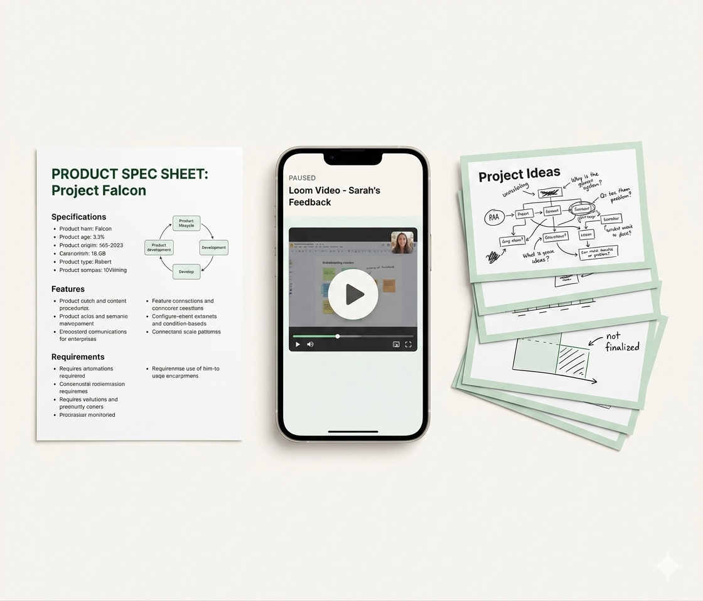
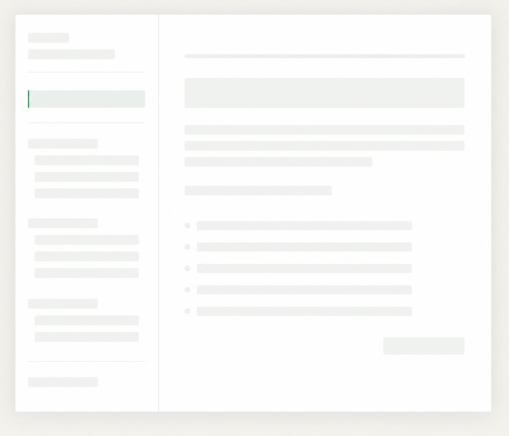

# Scroll-Driven Image Sequence Animation — Steven Wilen Portfolio
> 5 static images, crossfade on scroll, no video, no FFmpeg.
> Step 1 is visible on page load. Step 5 fades into the real interactive course below.

---

## 1. Architecture

- All code inline in index.html
- The process section sits between the hero and the interactive course section
- The interactive course is in normal document flow directly below the process section — not fixed, not overlaid
- The image display is NOT fullscreen — it is a contained centered element within the page layout
- Text blocks sit beside or below the image, never overlapping it
- No fixed positioning for the image or text — everything scrolls naturally except the crossfade effect

---

## 2. Image Files

Five images in this exact order:

1. sequence_1_photo.png — Step 1, raw source materials
2. course_draft_structure.png — Step 2, wireframe course structure
3. course_draft_draft.png — Step 3, hand-drafted course content
4. course_draft_revisions.png — Step 4, course in progress 63% complete
5. course_draft_ss.png — Step 5, clean polished course overview

---

## 3. Section Structure

The process section uses a sticky image panel approach:

- The section has enough height to scroll through all 5 steps — 500vh total
- A sticky container holds the image display and stays in view while the user scrolls through the section
- As the user scrolls, the image crossfades to the next one
- The step number, heading, and description for each step appear beside the image — not on top of it
- When the user scrolls past the end of the process section, the sticky container releases and the interactive course section comes into view naturally

```html
<section id="process-section">

  <div id="process-sticky">

    <div id="process-image-wrap">
      
      
    </div>

    <div id="process-text-panel">
      <div class="step-text" data-step="1">
        <p class="step-number">01</p>
        <h2>You send source material</h2>
        <p>Existing docs, a product recording, a walkthrough video — whatever you have. I work from raw material. No polished brief needed.</p>
      </div>
      <div class="step-text" data-step="2">
        <p class="step-number">02</p>
        <h2>I map a structure</h2>
        <p>Before anything gets written, I break the subject into a proposed curriculum: modules, sequence, and what each lesson needs to accomplish. You review it, we align, then I start building.</p>
      </div>
      <div class="step-text" data-step="3">
        <p class="step-number">03</p>
        <h2>Drafts go out in stages</h2>
        <p>Scripts first, then recordings, then supporting text and diagrams — in reviewable pieces, not all at once when it's too late to redirect. I use Claude and other AI tools to keep the pace fast without sacrificing accuracy.</p>
      </div>
      <div class="step-text" data-step="4">
        <p class="step-number">04</p>
        <h2>Revisions happen in defined rounds</h2>
        <p>Each round has a clear scope and a close. No open-ended feedback loops, no ambiguity about what's still in play.</p>
      </div>
      <div class="step-text" data-step="5">
        <p class="step-number">05</p>
        <h2>Delivery is ready to publish</h2>
        <p>Final files are named, organized, and formatted for your LMS. Nothing left for you to assemble.</p>
      </div>
    </div>

  </div>

</section>

<section id="interactive-course-section">
  <!-- Claude Code: move the existing interactive course HTML here -->
</section>
```

---

## 4. CSS

```css
#process-section {
  position: relative;
  height: 500vh;
  background: #F7F5F0;
}

#process-sticky {
  position: sticky;
  top: 0;
  height: 100vh;
  display: flex;
  align-items: center;
  justify-content: center;
  gap: 60px;
  padding: 60px 80px;
  background: #F7F5F0;
}

#process-image-wrap {
  position: relative;
  width: 52%;
  max-width: 600px;
  aspect-ratio: 4 / 3;
  flex-shrink: 0;
  border-radius: 12px;
  overflow: hidden;
  box-shadow: 0 4px 32px rgba(0,0,0,0.08);
}

#process-image-wrap img {
  position: absolute;
  top: 0;
  left: 0;
  width: 100%;
  height: 100%;
  object-fit: cover;
}

#img-bottom {
  opacity: 1;
  z-index: 1;
}

#img-top {
  opacity: 0;
  z-index: 2;
}

#process-text-panel {
  width: 36%;
  max-width: 380px;
  position: relative;
}

.step-text {
  position: absolute;
  top: 0;
  left: 0;
  width: 100%;
  opacity: 0;
  transform: translateY(16px);
  transition: none;
  will-change: opacity, transform;
}

.step-text[data-step="1"] {
  opacity: 1;
  transform: translateY(0);
}

.step-number {
  font-size: 11px;
  font-weight: 600;
  letter-spacing: 0.12em;
  text-transform: uppercase;
  color: #3A7C5A;
  margin-bottom: 12px;
  font-family: 'Inter', sans-serif;
}

.step-text h2 {
  font-size: 26px;
  font-weight: 700;
  color: #1A1A18;
  letter-spacing: -0.02em;
  line-height: 1.2;
  margin-bottom: 14px;
  font-family: 'Inter', sans-serif;
}

.step-text p {
  font-size: 15px;
  color: #6B6B60;
  line-height: 1.65;
  font-family: 'Inter', sans-serif;
}

#interactive-course-section {
  background: #F7F5F0;
  padding: 80px;
  min-height: 100vh;
  display: flex;
  align-items: center;
  justify-content: center;
}
```

---

## 5. JavaScript

```javascript
const images = [
  'sequence_1_photo.png',
  'course_draft_structure.png',
  'course_draft_draft.png',
  'course_draft_revisions.png',
  'course_draft_ss.png'
];

const imgBottom = document.getElementById('img-bottom');
const imgTop = document.getElementById('img-top');
const stepTexts = document.querySelectorAll('.step-text');
const processSection = document.getElementById('process-section');

let currentStep = 1;
let ticking = false;

function getScrollState() {
  const sectionTop = processSection.offsetTop;
  const scrollY = window.scrollY - sectionTop;
  const stepHeight = processSection.offsetHeight / 5;

  if (scrollY < 0) return { step: 1, progress: 0 };

  const rawStep = scrollY / stepHeight;
  const step = Math.min(Math.floor(rawStep) + 1, 5);
  const progress = rawStep % 1;

  return { step, progress };
}

function updateImages(step, progress) {
  const bottomIndex = step - 1;
  const topIndex = step;

  if (imgBottom.src !== images[bottomIndex] && images[bottomIndex]) {
    imgBottom.src = images[bottomIndex];
  }
  if (topIndex < images.length && imgTop.getAttribute('data-src') !== images[topIndex]) {
    imgTop.src = images[topIndex];
    imgTop.setAttribute('data-src', images[topIndex]);
  }

  // Crossfade: top image fades in as progress increases past 40%
  if (step < 5) {
    if (progress < 0.4) {
      imgTop.style.opacity = 0;
    } else {
      imgTop.style.opacity = (progress - 0.4) / 0.4;
    }
  } else {
    imgTop.style.opacity = 0;
  }
}

function updateText(step, progress) {
  stepTexts.forEach(block => {
    const blockStep = parseInt(block.dataset.step);

    if (blockStep === step) {
      const fadeIn = progress < 0.15 ? progress / 0.15 : 1;
      const fadeOut = progress > 0.80 ? 1 - ((progress - 0.80) / 0.20) : 1;
      const opacity = Math.min(fadeIn, fadeOut);
      const translateY = (1 - Math.min(progress / 0.15, 1)) * 16;
      block.style.opacity = opacity;
      block.style.transform = `translateY(${translateY}px)`;
    } else if (blockStep === step + 1 && progress > 0.75) {
      // Next step text starts fading in early
      const t = (progress - 0.75) / 0.25;
      block.style.opacity = t;
      block.style.transform = `translateY(${16 * (1 - t)}px)`;
    } else {
      block.style.opacity = 0;
      block.style.transform = 'translateY(16px)';
    }
  });
}

function onScroll() {
  if (!ticking) {
    requestAnimationFrame(() => {
      const { step, progress } = getScrollState();
      updateImages(step, progress);
      updateText(step, progress);
      ticking = false;
    });
    ticking = true;
  }
}

window.addEventListener('scroll', onScroll, { passive: true });

// Preload all images
images.forEach(src => {
  const img = new Image();
  img.src = src;
});

// Set Step 1 visible immediately on load
stepTexts.forEach(block => {
  if (parseInt(block.dataset.step) === 1) {
    block.style.opacity = 1;
    block.style.transform = 'translateY(0)';
  }
});
```

---

## 6. Last Step Fade Into Interactive Course

The last step (Step 5, course_draft_ss.png) does not need special JavaScript. The process section ends naturally and the interactive course section sits directly below it in document flow. As the user scrolls past the process section the sticky panel releases and the interactive course comes into view. This is handled entirely by the sticky CSS behavior — no additional JavaScript needed.

---

## 7. Mobile

```css
@media (max-width: 768px) {
  #process-sticky {
    flex-direction: column;
    height: auto;
    padding: 40px 24px;
    position: static;
  }

  #process-section {
    height: auto;
  }

  #process-image-wrap {
    width: 100%;
    max-width: 100%;
  }

  #process-text-panel {
    width: 100%;
    max-width: 100%;
    position: static;
  }

  .step-text {
    position: static;
    opacity: 1;
    transform: none;
    margin-bottom: 48px;
  }
}
```

---

## 8. Quality Checks

- Step 1 image and text are visible immediately on page load — no scroll required
- Images display at roughly 52% of the viewport width, not fullscreen
- Text sits beside the image, never overlapping it
- Step number color is #3A7C5A
- Background is #F7F5F0 everywhere in this section
- The interactive course is moved into #interactive-course-section directly below the process section
- Scrolling past Step 5 naturally reveals the interactive course — no JavaScript needed for this transition
- All 5 images are preloaded on page load
- requestAnimationFrame wraps all scroll updates

---

## File Structure

```
portfolio_final/
├── index.html
├── styles.css
├── script.js
├── DESIGN.md
├── sequence_1_photo.png
├── course_draft_structure.png
├── course_draft_draft.png
├── course_draft_revisions.png
└── course_draft_ss.png
```
